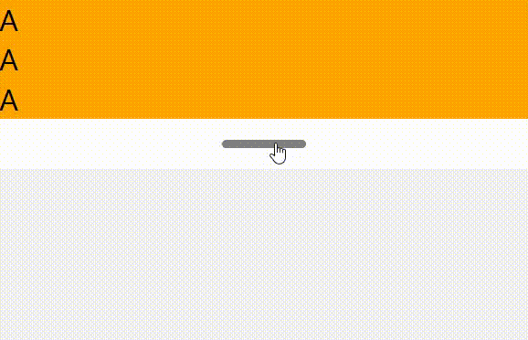

# react-native-drag-expand

<h3 align="center">
  Bring your own UI, headless drag expand view.
</h3>

[][npm]
[][npm]
[][license]
[][pr]

<br />
<br />



## Installing react-native-drag-expand

To install react-native-drag-expand:

```bash
npm install react-native-drag-expand
```

Next, add the view:

```tsx
import {DragExpandView} from 'react-native-drag-expand'
import {Text, View} from 'react-native'

export default function App() {
  return (
    // Styled view container
    <View>
      <DragExpandView>
        <DragExpandView.Collapsed>
          <View>
            <Text>Your collapsed content</Text>
          </View>
        </DragExpandView.Collapsed>
        <DragExpandView.Expanded>
          <View>
            <Text>Your expanded content</Text>
          </View>
        </DragExpandView.Expanded>
        <DragExpandView.Knob>
          <View>
            <Text>Your drag hold point view</Text>
          </View>
        </DragExpandView.Knob>
      </DragExpandView>
    </View>
  )
}
```

<!-- Definitions -->

[license]: https://github.com/sjwall/react-native-drag-expand/blob/main/LICENSE

[npm]: https://www.npmjs.com/package/react-native-drag-expand

[pr]: http://makeapullrequest.com
